<h1 align="center">應援交換小幫手</h1>

  用於整理演唱會應援交換資訊與計算應援物製作成本的個人小工具。(僅供我個人使用)

本專案為Vibe Coding練習。受到Threads上有網友分享類似工具的啟發，希望解決追星粉絲在活動會場交換應援禮物時，難以核對交換物品與人員資訊的問題，並加入應援物製作成本計算功能，方便個人規劃與使用。

本專案使用 React、TypeScript、Tailwind CSS 與 Supabase 開發，定位為個人練習及個人使用的小工具。

(截圖待補)

## 功能特色

- 儲存曾經進行應援交換的演唱會活動
- 計算每次活動的應援物製作成本
- 列出活動當次預計交換的粉絲名單
- 計算活動當天可發放的應援物剩餘數量
  
## 使用注意事項

- 本工具可透過電腦或行動裝置使用。為避免資料同步延遲，或後寫入的內容覆蓋先前的變更，請盡量不要在多個裝置或分頁中同時編輯同一筆資料。
- 若頁面已閒置一段時間，建議先重新整理並確認畫面顯示的是最新資料，再進行新增或編輯。
- 註冊與登入功能由 Supabase Auth 提供。系統管理者可能在管理後台看到維護帳號所需的基本資訊，例如電子郵件地址與登入紀錄；這些資訊僅用於帳號及系統管理。

## 使用說明

### 1. 開啟網站

本工具不需另外下載，可直接透過瀏覽器開啟：

👉 [開啟應援交換小幫手](https://isgexchange.onrender.com)

> 本網站部署於 Render，若一段時間無人使用，首次開啟時可能需要稍候片刻。

### 2. 將網站加入手機主畫面

使用行動裝置時，可以將網站加入主畫面，之後就能像一般 App 一樣快速開啟。

以下以 Google Chrome 為例：

| 自動顯示安裝提示 | 手動加入主畫面 |
|:---:|:---:|
| 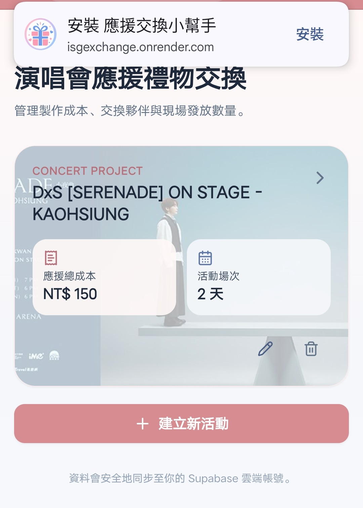 | 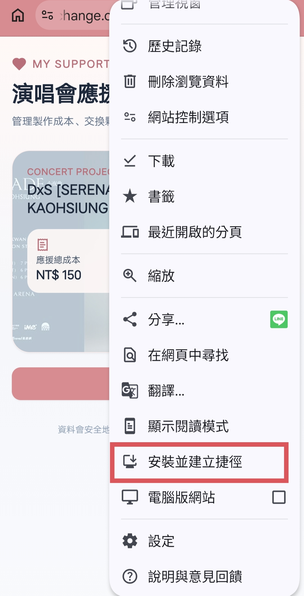 |

若畫面沒有自動顯示安裝提示，可以開啟 Chrome 選單，選擇「加到主畫面」或「安裝應用程式」。

### 3. 註冊及登入

首次使用時，請先註冊帳號：

1-1. 輸入電子郵件地址。  
1-2. 設定登入密碼。  
1-3. 完成註冊後，使用相同的電子郵件與密碼登入。  
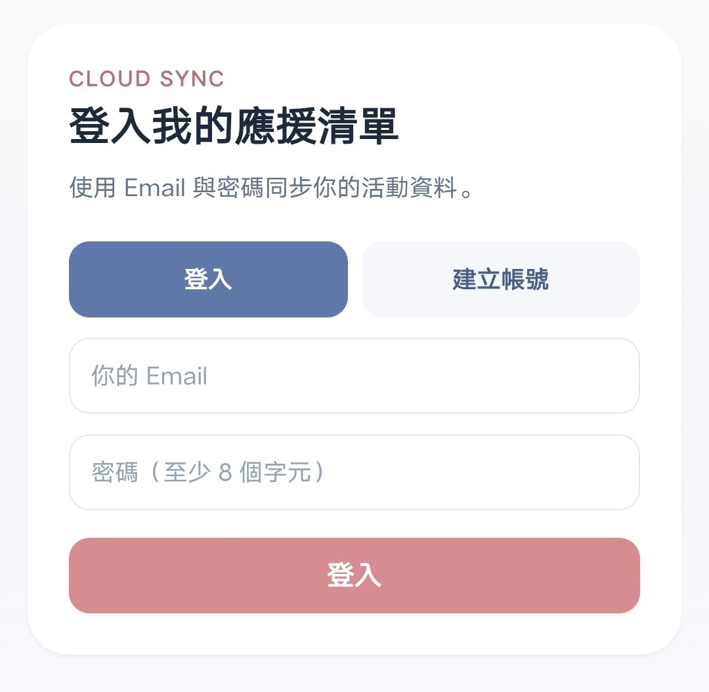

### 4. 首頁與活動管理 

登入後的首頁為活動清單，會列出過往活動紀錄，也可以建立新活動。  

| 首頁活動列表 | 建立活動 |
|:---:|:---:|
| 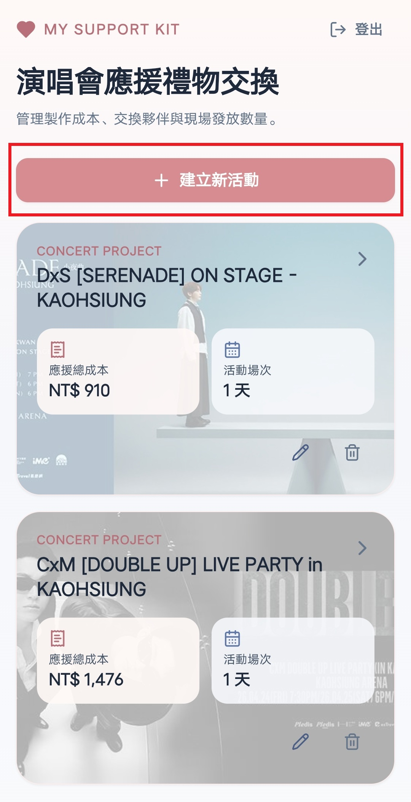 | 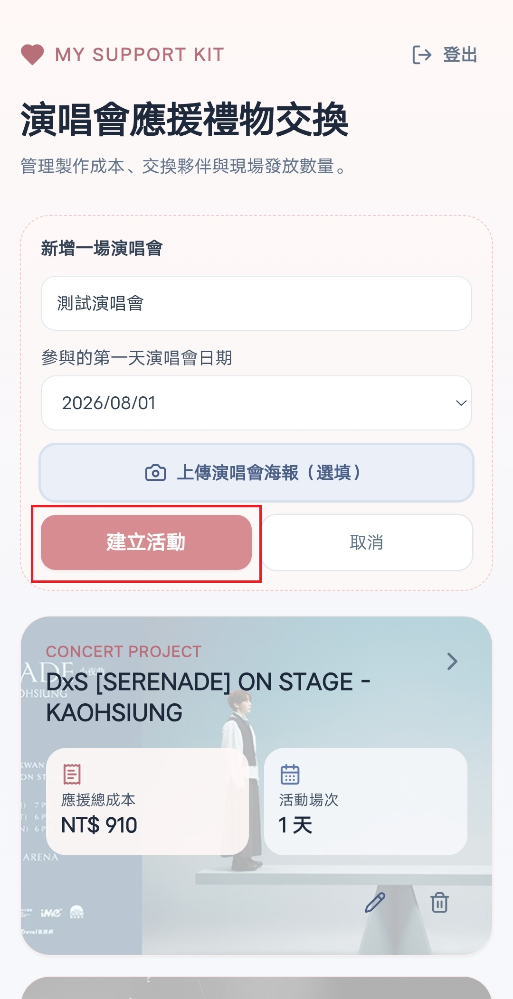 |

### 5. 應援物管理

建立活動後會進到活動內容頁面，首先可以先新增本次要製作的應援物，並記錄花費的成本。

| 活動內容頁面 | 新增應援物內容 |
|:---:|:---:|
| 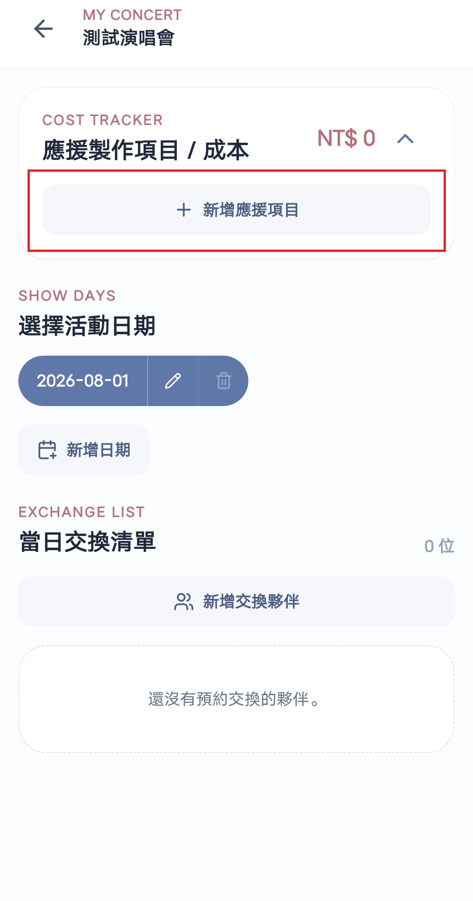 | 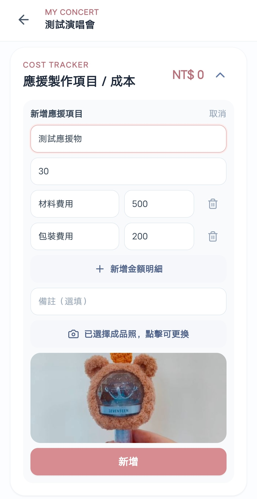 |

### 6. 交換夥伴管理

接下來可以新增交換夥伴，如果有填寫社群資訊，新增後可以透過點選夥伴卡片上的小圖示，直接連到該夥伴的社群帳號。

| 點選新增交換夥伴 | 新增交換夥伴內容 | 新增完成 |
|:---:|:---:|:---:|
| 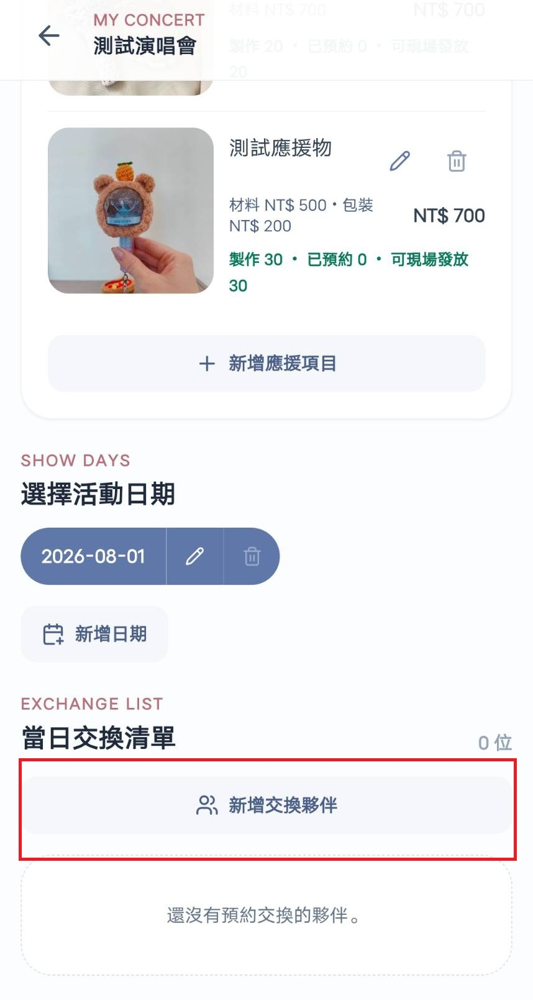 | 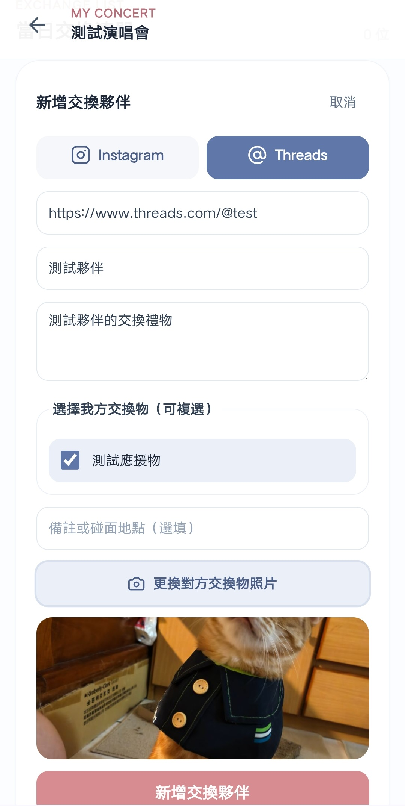 | 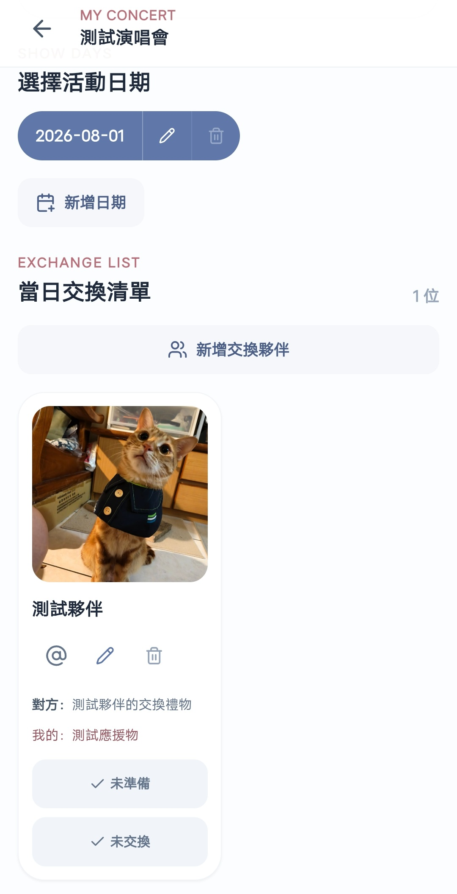 |

新增完成後透過標記該夥伴對應的應援物準備狀態/交換狀態，來管理交換清單，標記為**已交換**的夥伴排序會自動往後。
點選交換夥伴卡片，可以檢視詳細資訊：交換夥伴應援物大圖、備註內容(如交換地點等)。

| 標記狀態 | 交換夥伴詳細資訊 |
|:---:|:---:|
| 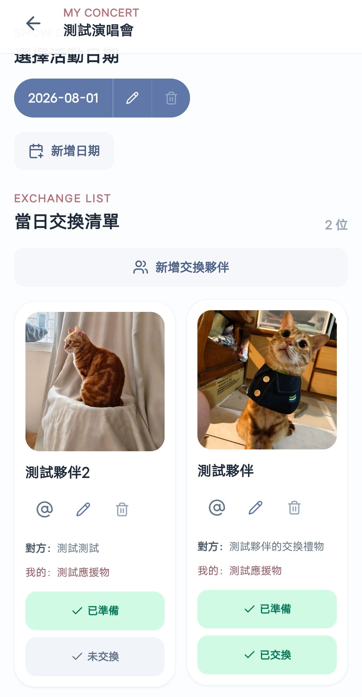 | 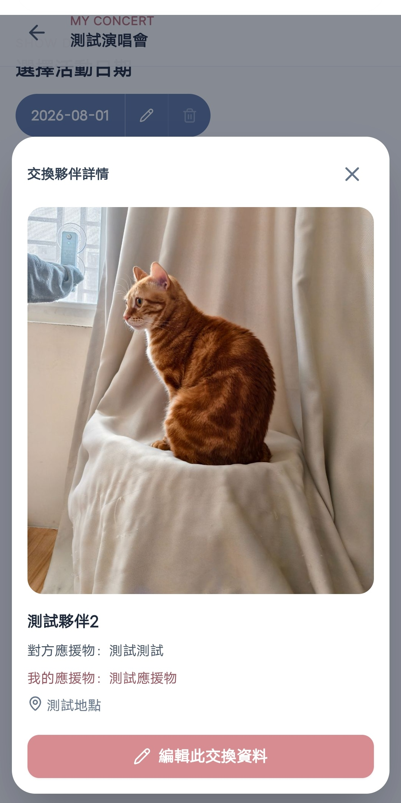 |

應援物中的**已預約、可交換**數量會隨著交換夥伴要交換的品項動態調整。  
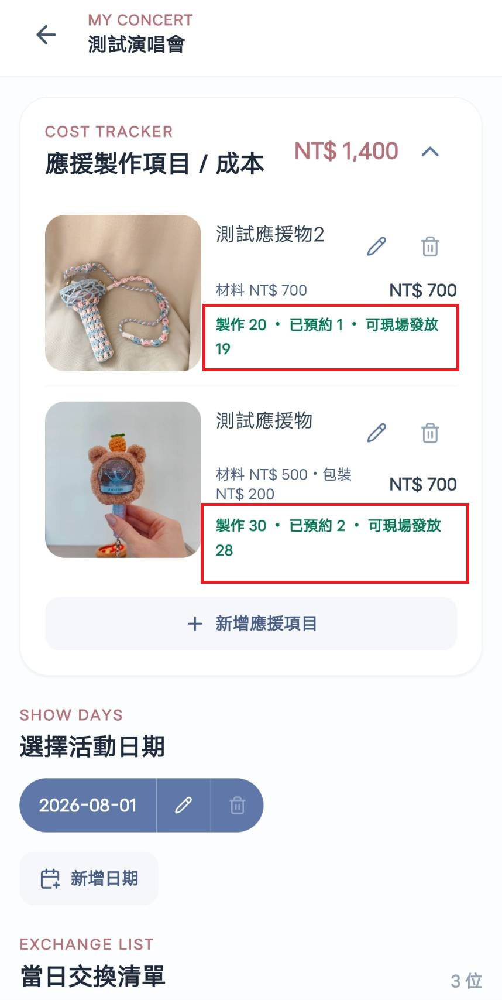  

### 7. 應援物清單上縮功能

如果準備的應援物品項較多，活動當天可以把應援物清單上縮，方便檢視交換夥伴清單。

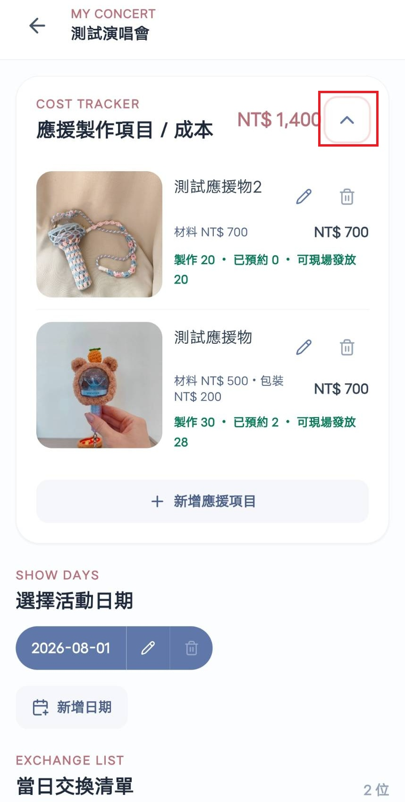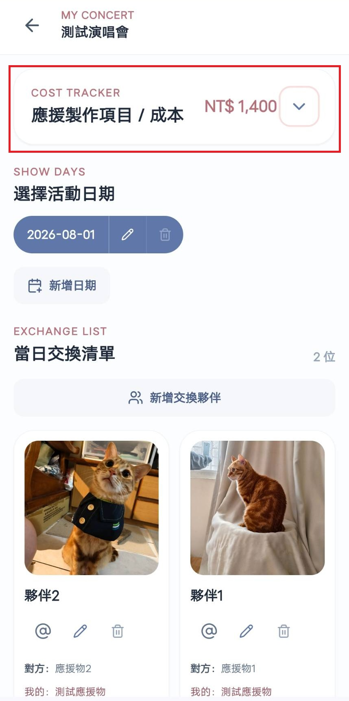
